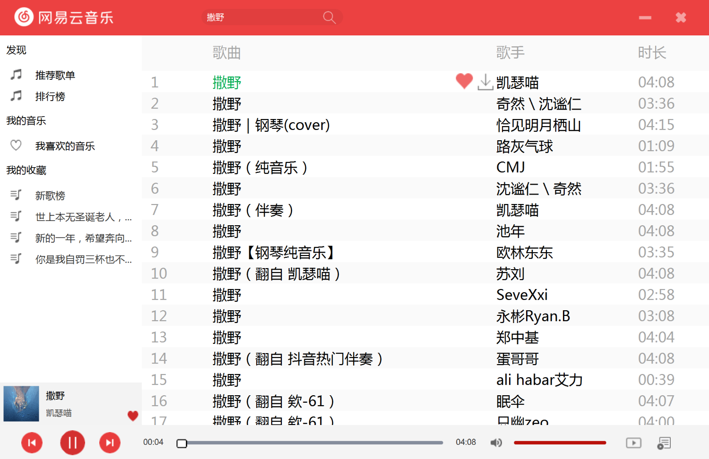
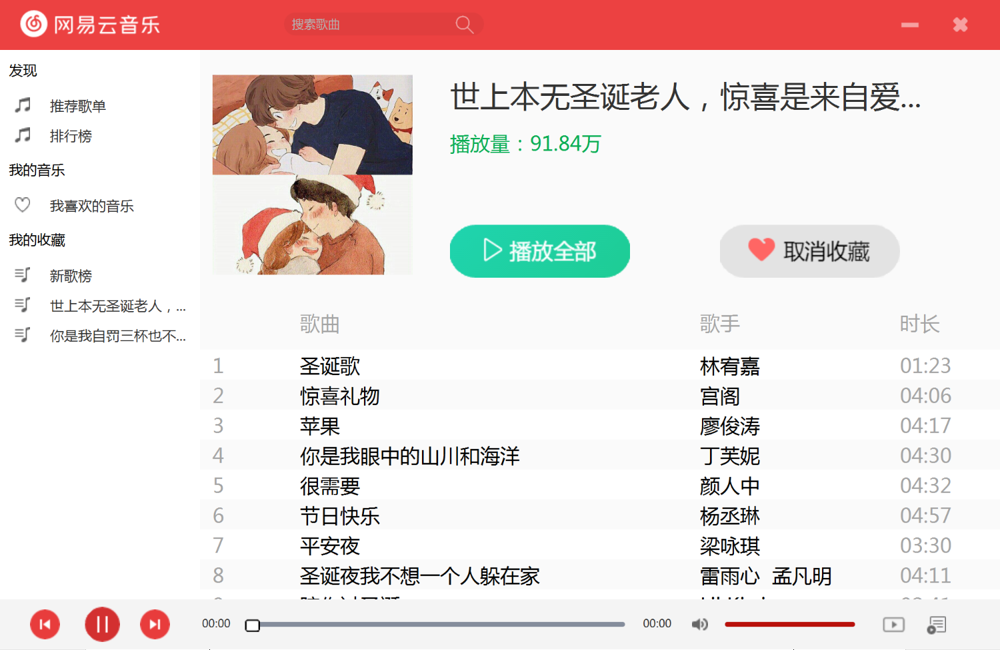
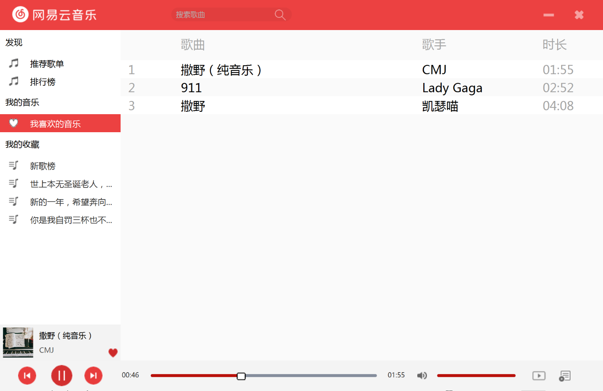
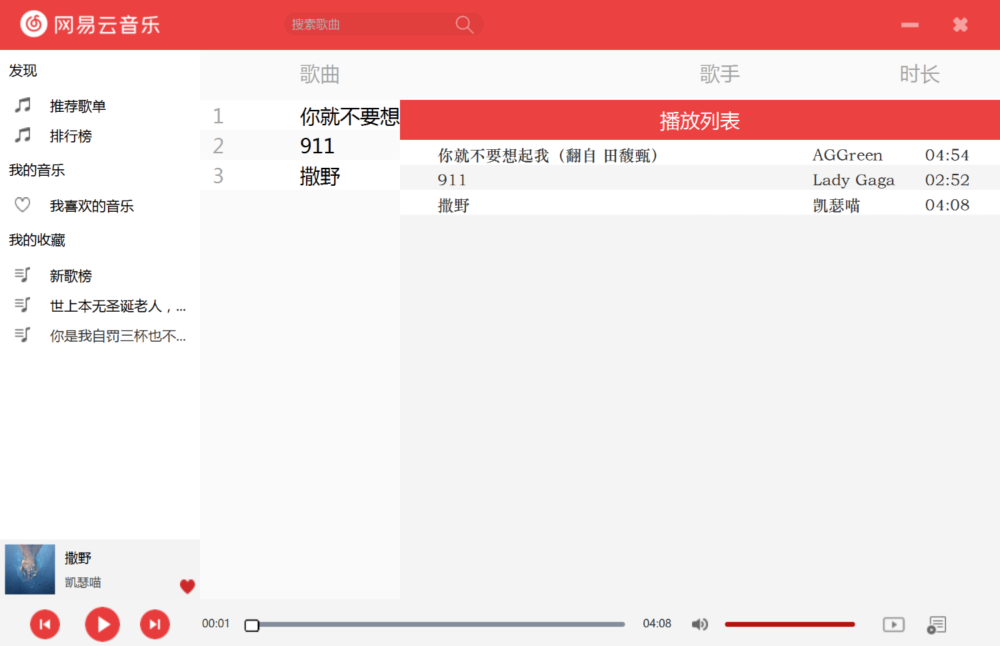

# JavaFinal

## 项目描述

借助[API](http://www.hjmin.com)，利用JavaFX完成一个仿制的网易云音乐PC客户端，具有每日推荐歌单、添加/删除播放列表歌曲、查看各大音乐排行榜、播放音乐、播放MV、收藏音乐、收藏歌单等功能。

## 项目所依赖的API

http://www.hjmin.com/

## 效果展示

### 推荐歌单页面（首页）

### 搜索页面

### 歌单详情页面

### 我喜欢的音乐

### 播放列表

## 测试环境

### 环境1
64位 Windows 10 专业版

IntelliJ IDEA Ultimate 2020.3

Java 1.8.0_261（包含Javafx）

MySQL 8.0.19 for Win64

Eclipse IDE for Java Developers：Oxygen.3a Release (4.7.3a)

### 环境2
macOS Big Sur 11.4 (M1)

IntelliJ IDEA Ultimate 2021.1.2

Java 1.8.0_291（包含Javafx）

MySQL 8.0.25 x86-64 for macOS11

## 运行所需的额外jar包：（已包含于.\lib中）

json-20201115.jar（org.json）

mysql-connector-java-8.0.21.jar

## MySQL配置

MySQL数据库用户名：root（位于src/data/Database.java的第24行）

MySQL数据库密码：123admin（位于src/data/Database.java的第24行）

MySQL数据库名称：net_ease_music（在运行前需要新建一个该名称的数据库）
